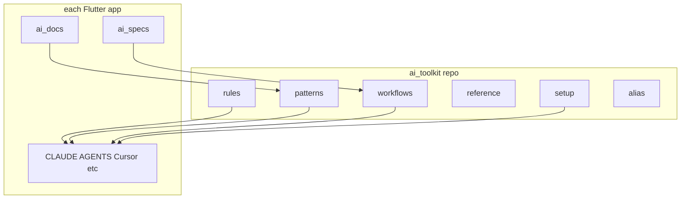

# ai_toolkit hierarchy (Flutter-first, tool-neutral)

## Context and constraint

- **Source of truth** lives in `ai_toolkit/` as **plain Markdown** (no Cursor `SKILL.md` or vendor files in this repo).
- **Per app**: thin bootstrap (`CLAUDE.md`, `AGENTS.md`, `.cursor/rules`, etc.) that **points to** paths under `ai_toolkit/` (stable paths like `ai_toolkit/rules/core/network.md`).
- **Naming**: Use **`workflows/`** only (not `commands/`). Same role as Andrea’s “commands” in spirit; “workflow” matches phased content better. Document that in README so Claude Code users are not confused.

## Canonical stack (Magdy) — lock decisions in the tree

These packages and choices are **defaults for patterns and rules** you will fill in later. They are listed here so nothing is forgotten when creating placeholder files.

| Area | Choice |
|------|--------|
| UI / platforms | Mobile iOS & Android |
| State | **Bloc / Cubit** |
| DI | **get_it + injectable** |
| Network | **Dio** |
| Serialization | **json_serializable** (generated `*.g.dart`) — **not Freezed** for these models unless you add an explicit exception later |
| Errors | **dartz `Either<Failure, T>`** in repositories; centralized failures/exceptions |
| Other libs | **firebase**, **flutter_gen**, **responsive_framework**, **path_provider**, **intl**, etc. (as in your projects) |

**Placeholder-first:** The structure below includes **files to create early** (even empty) so later sessions do not miss topics. Each placeholder MUST start with a short header (see [Placeholder file template](#placeholder-file-template)).

## Bootstrap: `bootstrap-session` vs `seed-context-claude` (recommendation)

**Recommendation for the toolkit (best fit for multi-tool + your Claude Code habit):**

1. **`ai_toolkit/workflows/session/bootstrap-session.md`** — **Single neutral playbook**: ordered steps (“read `INDEX.md` → load aliases for shell → load stack patterns → if feature work, open active file in `ai_specs/` → optional `ai_docs/`”). No vendor name in the path.
2. **Per-app only:** **`CLAUDE.md`** (or `AGENTS.md`) with 5–10 lines: “Follow `ai_toolkit/INDEX.md`; for session start run the steps in `ai_toolkit/workflows/session/bootstrap-session.md`.” Optionally add a **local alias** in docs: “Claude Code users may refer to this as *seed-context*” — same content, no second file required in the toolkit.

**Why not `seed-context-claude.md` inside the toolkit?** It couples the repo name to one product. Neutral name + optional app-side nickname avoids duplication and keeps Codex/Cursor/others aligned.

If you later want a literal **`seed-context-claude.md`** for muscle memory, add it **inside a specific app repo** as a one-line pointer: `See ../ai_toolkit/workflows/session/bootstrap-session.md`.

## Mental model: three layers

| Layer | Purpose | When the AI loads it |
|------|---------|----------------------|
| **Rules** | Must / must-not (short, enforceable) | Every session or when touching a domain |
| **Patterns** | How-to + examples | Implementing or reviewing a feature area |
| **Workflows** | Ordered pipelines (spec → plan → phases → verify) | Starting or continuing structured work |



## Proposed top-level layout (with placeholders and subdivided workflows)

Use this tree as the **contract**. Empty files are OK until you refine content from your repos.

```text
ai_toolkit/
  README.md
  INDEX.md

  alias/
    flutter.md              # existing — shell aliases
    firebase.md             # existing — Firebase / FlutterFire

  setup/
    README.md               # what belongs in setup vs patterns vs workflows
    new-flutter-app.md      # checklist: create app, lints, injectable, flavors optional
    melos-monorepo.md       # optional placeholder if you use Melos later
    ci-github-gitlab.md     # optional placeholder for CI recipes

  rules/
    dart/
      _index.md
      imports-and-analysis.md   # placeholder — analyzer / lints policy
    flutter/
      _index.md
      widgets-and-performance.md
    testing/
      _index.md
    git/
      _index.md
    tooling/
      _index.md
      build-runner.md
    firebase/
      _index.md
      security-public-repos.md  # e.g. firebase_options.dart / public repos
    core/                         # lib/core usage — split by concern (see below)

  patterns/
    dart/
      absolute-imports.md     # migrate from patterns/absolute-imports.md
    state/
      bloc-structure.md         # placeholder
      cubit-vs-bloc.md          # placeholder
    data/
      json-models-json-serializable.md  # explicit: not Freezed by default
      dio-and-repositories.md           # placeholder
      either-and-failures.md            # placeholder
    di/
      injectable-get-it.md              # placeholder — sync with rules/core/di.md
    flutter/
      responsive-and-layout.md          # placeholder
    platform/
      ios-pods-and-build.md             # optional — links to alias notes

  workflows/
    README.md                 # explains subfolders; no duplicate prose with INDEX
    session/
      bootstrap-session.md    # neutral session start (replaces vendor-specific name)
    feature-delivery/
      make-plan.md            # phased plan from spec; reads ai_docs when present
      implement-phase.md      # optional — execute one checklist phase
      verify-and-pr.md        # optional — tests + PR description
    maintenance/
      bugfix.md
      refactor.md
      dependency-upgrade.md
    git/
      commit-after-phase.md   # conventional commit per plan phase

  reference/
    breaking-changes-notes.md
    checklist-new-screen.md

  core_placeholders_note.txt  # optional — see note; OR document only in README
```

### `rules/core/` — mirror `lib/core/` so agents respect how core is built

Your **`flutter_base`** `lib/core/` is organized around: **`core.dart` barrel + part files**, **foundation**, **network** (Dio, interceptors, errors), **di**, **domain/data** (use cases, repos for cross-cutting concerns like auth/language), **blocs** (app-level auth, language), **configs** (theme, router, values), **localization**, **services**, **utils**, **constants**.

**Vorma** uses the same ideas with small naming/layout differences (`base/` vs `foundation/`, `config/` vs `configs/`) — rules should say “follow **this app’s** `ai_docs/architecture.md` when paths differ.”

Suggested **`rules/core/`** files (placeholders first; you refine from `flutter_base` + `vorma` later):

| File | Scope |
|------|--------|
| `rules/core/_index.md` | Map of core sections; “read ai_docs for app-specific naming.” |
| `rules/core/barrel-and-parts.md` | When `core.dart` uses `part` / exports; what belongs in barrel vs feature. |
| `rules/core/foundation.md` | `IUseCase`, typedefs, async helpers, safe emit mixin. |
| `rules/core/network.md` | Dio helper, interceptors, exception → failure mapping. |
| `rules/core/di.md` | injectable registration; **no** `getIt` in widgets; bloc/cubit `@injectable`. |
| `rules/core/domain-data-in-core.md` | Cross-cutting repos/use cases live here vs feature folders. |
| `rules/core/blocs-app-wide.md` | App auth bloc, language cubit — scope vs feature blocs. |
| `rules/core/theme-router-config.md` | Theme manager/router/values; generated assets. |
| `rules/core/localization.md` | l10n container, language enum, caching language. |
| `rules/core/services.md` | Share, launcher, rate, vibrator — thin wrappers. |
| `rules/core/utils.md` | Extensions, validators — no business rules sneaking in. |

**Analysis sources for future fill-in (not part of `ai_toolkit` repo):**

- [`/Volumes/Work/flutter_base/flutter_base/lib/core/`](file:///Volumes/Work/flutter_base/flutter_base/lib/core/) — primary reference for barrel structure and modules.
- [`/Volumes/Work/01_moltaqa/vorma/lib/core/`](file:///Volumes/Work/01_moltaqa/vorma/lib/core/) — secondary reference for variants (`base/`, pagination, deep links).

## Workflows folder organization (avoid mess)

Subfolders group **intent**:

| Subfolder | Holds |
|-----------|--------|
| **`session/`** | Start-of-session / context loading only |
| **`feature-delivery/`** | Spec-driven feature work |
| **`maintenance/`** | Bugs, refactors, upgrades |
| **`git/`** | Commit cadence aligned to phases |

Add new files under the closest folder; if something spans types, **`workflows/README.md`** points to the right subfolder.

## Placeholder file template

Every placeholder `.md` MUST begin with:

```markdown
# <Title>

## Purpose
One or two sentences: what this doc governs.

## Fill when
Bullets: e.g. “After you lock analyzer rules”, “When DI registry conventions change.”

## References
- Optional paths in **your app repos** (not copied here): e.g. `lib/core/di/di.dart`

## Content
<!-- Fill in later. Leave empty if unknown. -->
```

No implementation prose is required until you review.

## Patterns vs rules (reminder)

- **Rules** — short; **`rules/core/`** is ideal for “how agents must use existing core modules.”
- **Patterns** — longer examples (Bloc files, Dio repo snippet). Keep **`patterns/data/`**, **`patterns/di/`**, **`patterns/state/`** aligned with **`rules/core/`** so they do not contradict.

## Data layer decision (confirmed)

- **json_serializable** for models; run **`brb`** after changes.
- **Do not use Freezed** for those models unless you document an explicit exception in `patterns/data/` + `rules/dart/`.

## Per-app folders (not inside `ai_toolkit`)

Recommended stubs (referenced by **`workflows/feature-delivery/make-plan.md`**):

- `ai_docs/architecture.md` — app-specific core vs feature boundaries (include **your** `lib/core` layout).
- `ai_docs/conventions.md` — naming, folders, when to add to core vs feature.

## What stays **out** of `ai_toolkit`

- Secrets, env URLs, client IDs.
- Per-feature specs (`ai_specs/` in each app).
- Full architecture prose that is **only** true for one product (that lives in **`ai_docs/`**).

## Implementation sequence (execute when you approve)

1. Add **`README.md`** + **`INDEX.md`** (bootstrap, lite/full, task → folder routing).
2. Create directory tree and **all placeholder files** using the template above (including **`rules/core/*`**, **`setup/*`**, subdivided **`workflows/*`**).
3. Migrate **`patterns/absolute-imports.md`** → **`patterns/dart/absolute-imports.md`**.
4. Seed minimal real content only where you already have it: **`alias/flutter.md`**, **`alias/firebase.md`**, **`patterns/dart/absolute-imports.md`**.
5. In later sessions: fill **`rules/core/*`** and **`patterns/*`** using **`flutter_base`** and **`vorma`** `lib/core/` as ground truth.
6. Per app: short **`CLAUDE.md`** / **`AGENTS.md`** pointing at **`ai_toolkit/INDEX.md`** and **`workflows/session/bootstrap-session.md`**.
