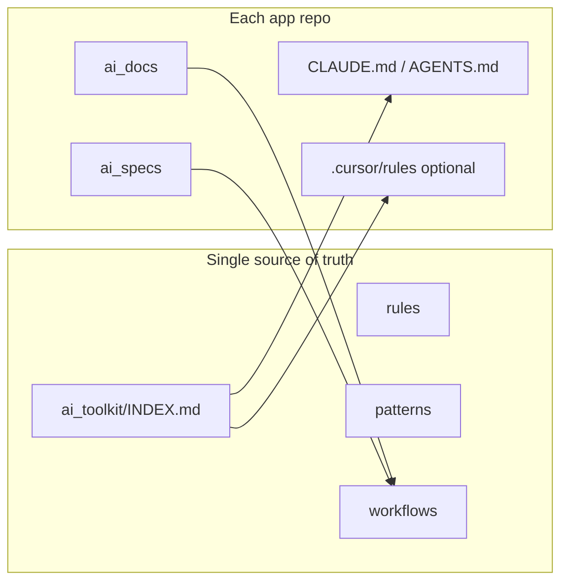

# ai_toolkit analysis, gaps, and session seeding

## What you implemented vs the original plan

The hierarchy in [.cursor/plans/ai_toolkit_flutter_hierarchy_2694e7d4.plan.md](/Volumes/Work/flutter_base/flutter_base/.cursor/plans/ai_toolkit_flutter_hierarchy_2694e7d4.plan.md) is largely in place: [ai_toolkit/INDEX.md](ai_toolkit/INDEX.md), section `_index.md` files, subdivided `workflows/`, `rules/core/*`, `patterns/*`, `setup/*`, [ai_toolkit/README.md](ai_toolkit/README.md), and thin app boots [CLAUDE.md](CLAUDE.md) / [AGENTS.md](AGENTS.md). The plan’s intent—“tool-neutral Markdown, per-app thin pointers”—is consistent with the current tree.

**Representative depth:** [ai_toolkit/rules/core/network.md](ai_toolkit/rules/core/network.md) is senior-grade (concrete conventions, cross-repo references). [ai_toolkit/patterns/state/bloc-structure.md](ai_toolkit/patterns/state/bloc-structure.md) and [ai_toolkit/rules/testing/_index.md](ai_toolkit/rules/testing/_index.md) are still placeholder shells—so the kit is **navigationally complete** but **content maturity is uneven**.

**Per-app layer:** [ai_docs/architecture.md](ai_docs/architecture.md) remains a stub. For seniors, that is the highest-leverage file to fill: it is where **your** `lib/core` layout and exceptions override generic toolkit defaults.

---

## Senior Flutter developer lens: strengths

- **Clear layering:** Rules vs patterns vs workflows matches how experienced devs think about “must obey” vs “how we usually do it” vs “procedure for this task.”
- **Stable entrypoint and routing:** INDEX task tables reduce random walks through folders.
- **Lite vs full bootstrap:** Appropriate cost control for small edits vs large changes ([bootstrap-session.md](ai_toolkit/workflows/session/bootstrap-session.md)).
- **Stack defaults documented:** Bloc/Cubit, Dio, injectable, json_serializable, Either/failures—aligned with a common production stack.

---

## Senior Flutter lens: gaps (content and coverage)

These are typical areas seniors hit daily but are thin or missing in the kit today:

| Area | Current state | Why it matters for seniors |
|------|----------------|---------------------------|
| **Testing policy** | [rules/testing/_index.md](ai_toolkit/rules/testing/_index.md) empty | Defines mock strategy, widget vs integration boundaries, golden policy, CI gates. |
| **Bloc/Cubit patterns** | [patterns/state/bloc-structure.md](ai_toolkit/patterns/state/bloc-structure.md) empty | File layout, event/state naming, when feature bloc vs cubit, testing hooks. |
| **Navigation / routing** | Partially implied in [rules/core/theme-router-config.md](ai_toolkit/rules/core/theme-router-config.md) | go_router (or your choice): typed routes, deep links, redirect/auth guard patterns—often a top source of inconsistency. |
| **Observability** | Not a first-class folder | Crashlytics/Sentry, logging levels, PII rules—pairs with production Flutter work. |
| **Release & stores** | Setup has CI placeholder | Internal testing tracks, versioning, flavor matrix—often cross-team. |
| **Concurrency / isolates** | Not listed | Heavy JSON/image work, compute patterns—seniors care when UI jank appears. |
| **Security storage** | Firebase rules exist; keychain/encrypted prefs less visible | Auth token handling beyond Dio interceptors. |

**Prioritized fill order (if you add files):** (1) app `ai_docs/architecture.md` + conventions, (2) testing rules + pattern links to real `test/` layout, (3) navigation/routing pattern aligned with your router module, (4) observability mini-rule or pattern, (5) optional isolates/performance note under `patterns/flutter/` or `reference/`.

---

## Reusable spec-driven cycles for other developers / teams

The kit already encodes the cycle: **spec → plan → phased implement → verify/PR** ([make-plan.md](ai_toolkit/workflows/feature-delivery/make-plan.md), [implement-phase.md](ai_toolkit/workflows/feature-delivery/implement-phase.md), [verify-and-pr.md](ai_toolkit/workflows/feature-delivery/verify-and-pr.md)). To make this **portable across repos** without everyone forking prose:

1. **Treat `ai_toolkit/` as a versioned artifact** — tag releases in git; consumers pin a tag or commit SHA in their README (“toolkit at commit X”).
2. ** Submodule or subtree** — Same repo folder path `ai_toolkit/` everywhere so paths in INDEX stay valid; alternative is a **template repo** that clones the toolkit into that path as part of bootstrap.
3. **Never fork INDEX paths** — Teams customize only `ai_docs/`, `ai_specs/`, and optional small overrides in app bootstrap files; stack deviations belong in `ai_docs/conventions.md` with explicit “exception to toolkit defaults.”
4. **Optional one-page “adoption” section** in [ai_toolkit/README.md](ai_toolkit/README.md) — three bullets: copy/submodule layout, required thin `CLAUDE.md`, required `ai_docs` stubs for boundaries.

---

## Seeding Cursor and Claude every session (canonical toolkit, no duplicate skills)

Your design already avoids vendor lock-in: **no Cursor SKILL.md inside the toolkit** (per plan). To prevent each developer inventing parallel rules:

**Claude Code / Claude-friendly tools**

- Keep a **single** thin root file: [CLAUDE.md](CLAUDE.md) (and parity [AGENTS.md](AGENTS.md) for Cursor agents) pointing to `ai_toolkit/INDEX.md` then `workflows/session/bootstrap-session.md` — already done.
- Team norm: **do not** paste large rule dumps into CLAUDE.md; extend the toolkit or `ai_docs/` instead.

**Cursor IDE**

- **Workspace rules:** Add a small **always-on** project rule under `.cursor/rules/` (e.g. one `.mdc`) whose only job is: “Start from `ai_toolkit/INDEX.md`; follow lite/full per task; do not duplicate toolkit content in chat.” This complements (does not replace) the global [CLAUDE.md](CLAUDE.md)-style instructions Cursor may load.
- **User vs project:** Project rule = shared with the team; user rule = personal—prefer project-level for consistency.
- **Optional globs:** If most edits are under `lib/`, a scoped rule can remind agents to load `rules/core/*` when touching `lib/core/`—reduces noise vs alwaysApply everywhere.

**Process (human)**

- **Code review checklist:** PR template item: “Touches core? Linked rule/pattern updated or noted in ai_docs.”
- **Onboarding:** One doc link: “Read INDEX → bootstrap-session → your active ai_specs file.”

**What not to do**

- Duplicating the toolkit into a Cursor Skill or long `.cursor/rules` copies—it drifts from [INDEX.md](ai_toolkit/INDEX.md) immediately. Short pointers only.

---

## Summary recommendation

The hierarchy **meets senior Flutter needs structurally**; the **main work ahead is content depth** (testing, state patterns, routing, observability) and **filling app-specific `ai_docs/`** so the toolkit’s defaults do not fight the real repo. For **cross-team reuse**, version the toolkit and submodule/copy with stable paths. For **session seeding**, keep **one canonical Markdown tree** plus **thin** Claude/AGENTS + optional **one** always-on Cursor rule that points at INDEX—no parallel rule corpora.
