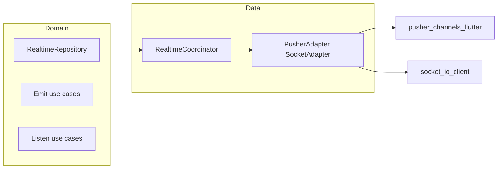

# Unified `app_realtime` feature plan

## Current baseline in this repo

- [`pubspec.yaml`](pubspec.yaml) already depends on `socket_io_client`; ensure `pusher_channels_flutter` is declared if not already (required by [`lib/src/pusher/pusher_handler.dart`](lib/src/pusher/pusher_handler.dart)).
- **In-project legacy modules to supersede** (then delete after `app_realtime` is wired):
  - **Pusher**: [`lib/src/pusher/`](lib/src/pusher/) — e.g. [`pusher_handler.dart`](lib/src/pusher/pusher_handler.dart) + [`config.dart`](lib/src/pusher/config.dart) (`part`). This is the concrete baseline to distill into the Pusher adapter/coordinator (behavior matches your earlier [`vorma` reference](file:///Volumes/Work/01_moltaqa/vorma/lib/core/utils/pusher/pusher_handler.dart), adapted here).
  - **Socket**: [`lib/src/_socket/`](lib/src/_socket/) — designated socket feature folder in this project; fold its types/APIs into the Socket adapter/coordinator, then remove the folder.
- **External references** (patterns only): [`Motogo` `SocketDataSourceImpl`](file:///Volumes/Work/01_moltaqa/Motogo-App/lib/feature/common/socket/data/socket_data_source_impl.dart) for Socket.IO stream/event handling ideas if `_socket` is thin or missing pieces on a branch.

## Goals (mapped to design)

| Requirement | Approach |
|-------------|----------|
| Pusher vs Socket from config | Sealed `RealtimeTransportConfig` with one variant per backend; factory builds a single [`RealtimeCoordinator`](lib/src/app_realtime/) (name flexible) + thin adapters. |
| One abstraction, reusable streams | **Coordinator owns all `StreamController`s and refcounting** — Pusher/Socket code only forwards raw events and performs transport calls; no duplicate stream logic in adapters. |
| Multi-event per channel | Normalize to [`RealtimeEnvelope`](lib/src/app_realtime/models/) `{ channelKey, eventName, payload }`. Pusher: fan-in from `onEvent`. Socket: map `socket.on(eventName)` into the same envelope type. Optional `watch(channel, events: {...})` filter at coordinator level. |
| Pusher: cannot emit until subscribed | Track per-channel `SubscriptionState` (`idle` / `subscribing` / `ready` / `failed`). **Queue** `(eventName, payload)` until `onSubscriptionSucceeded`, then flush via `trigger`. Expose `Either<Failure, void>` on emit if still not ready after timeout or on terminal failure. |
| Unsubscribe / multi-listener | Per logical channel: **refcount** subscribers; coordinator subscribes transport once at first listener and unsubscribes when refcount hits 0 (same pattern as broadcast `StreamController` + listener count). |
| DI scope reset | Register coordinator as **singleton** with explicit [`disposeAll()`](lib/src/app_realtime/) (close controllers, cancel pending completers, clear queues, disconnect adapters). Call from the same place you already reset scope ([`resetDependenciesScope`](lib/core/di/di.dart)) — e.g. small `RealtimeModule` helper or post-reset hook so streams never leak across user sessions. |
| Guest / not logged in | `RealtimeAuthProvider` returns `null` token; config flag `allowGuestConnect` (socket: connect without auth query/header per your API; pusher: still `init`/`connect` for public channels, skip private auth until token exists). Coordinator exposes `ensureConnected(requireAuth: false)`. |
| Private channels + tokens | Encapsulate in **`RealtimeAuthProvider`** + **`RealtimeChannelAuthorizer`** (Pusher `onAuthorizer` delegates here; implementation uses `Dio` + bearer from provider — same idea as vorma’s `_onAuthorizer`). |
| Completer / no duplicate connect-subscribe | Per channel and global connection: **`Future<void> _once(String key, Future<void> Function() op)`** using `Completer` or cached `Future` while in-flight; reuse for `connect()` and `subscribe(channel)`. |
| Debounce / transformers | Optional `RealtimeListenOptions` with `debounce` / `distinct` applied **only in coordinator** when exposing `Stream<RealtimeEnvelope>` (keeps adapters dumb). BLoC can subscribe with `stream.transform(...)`. |
| Domain + use cases | [`IUseCase`](lib/core/foundation/i_use_case.dart) is **`Future<Either<Failure, T>>`** — it does not model streaming. Plan: **`IRealtimeEmitUseCase`** extends `IUseCase<void, RealtimeEmitParams>` for emit; **`listen`** uses a **separate** `abstract class IRealtimeListenUseCase<T, P>` with `Stream<Either<Failure, T>> listen(P params)` (or `Stream<T>` if you parse failures only at coordinator — recommend `Either` for parse errors). Base **`RealtimeParams`** with `channelName`, optional `eventNames`, and extension params via subclasses. |
| Repository in datasource | `RealtimeRepository` (domain) implemented by `RealtimeRepositoryImpl` calling **only** the coordinator (not raw Pusher/Socket), matching how you want feature datasources to consume it. |
| Docs | Add [`lib/src/app_realtime/README.md`](lib/src/app_realtime/README.md) (or `REALTIME.md`): config variants, guest vs auth, multi-event, emit queueing, refcount unsubscribe, DI dispose, and example use case + cubit wiring. |
| Remove legacy | After migration, delete [`lib/src/_socket/`](lib/src/_socket/) and [`lib/src/pusher/`](lib/src/pusher/), barrels, and stray imports. |

## Architecture (concise)

- **Adapters** implement a small internal interface, e.g. `RealtimeTransport`:
  - `Future<void> connect(RealtimeConnectContext ctx)`
  - `Future<void> disconnect()`
  - `Future<void> subscribe(String channel, TransportCallbacks cb)`
  - `Future<void> unsubscribe(String channel)`
  - `Future<void> emit(String channel, String event, dynamic payload)` (Pusher: guarded; Socket: emit after connect)

- **Coordinator** is the only place that:
  - merges inbound events into `Stream<RealtimeEnvelope>`
  - refcount + subscribe/unsubscribe
  - emit queue for Pusher
  - connection/subscription deduplication

## Library layout (mirror [`app_pagination`](lib/src/_pagination/app_pagination.dart))

- [`lib/src/app_realtime/app_realtime.dart`](lib/src/app_realtime/app_realtime.dart) — `library app_realtime;` + `part` directives.
- `config/` — sealed `realtime_transport_config.dart`, `realtime_connect_context.dart`.
- `models/` — `realtime_envelope.dart`, `realtime_emit_request.dart`, `subscription_state.dart`, shared/base params.
- `data/` — `realtime_coordinator.dart`, `adapters/pusher_realtime_adapter.dart`, `adapters/socket_realtime_adapter.dart`, `realtime_repository_impl.dart`.
- `domain/` — `realtime_repository.dart`, `realtime_auth_provider.dart` (abstract), `use_cases/` + `i_realtime_listen_use_case.dart`.
- `di/` — injectable registrations + optional dispose binding.

## Dependency and cleanup

1. Add `pusher_channels_flutter` (version aligned with Flutter/Dart in this project).
2. Wire both transports behind sealed config; **no** direct `PusherHandler`/`SocketDataSource` usage in features — only `RealtimeRepository` / use cases.
3. Remove obsolete modules: [`lib/src/_socket/`](lib/src/_socket/) and [`lib/src/pusher/`](lib/src/pusher/), plus any barrel exports/imports and duplicate DI registrations after grep confirms zero references.

## Implementation risks / notes

- **Socket channel model**: Motogo uses **event names** globally, not “rooms”. If your API uses rooms, extend `RealtimeEmitParams` / adapter to `emit('join', {room})` — coordinator still exposes channel-like keys for the domain layer.
- **Pusher client-trigger**: Server must allow client events on channel; queue only helps **after** local subscription succeeds — cannot bypass server rules.
- **Testing**: Coordinator logic is testable with fake `RealtimeTransport` without real network.

## Deliverables checklist

- Sealed config + factory.
- Coordinator + two adapters + repository + auth hooks.
- Emit/listen use-case bases + example concrete use case pair.
- README for usage.
- DI registration + `disposeAll` on scope reset.
- Delete legacy [`lib/src/_socket/`](lib/src/_socket/) and [`lib/src/pusher/`](lib/src/pusher/) code paths from this package.
